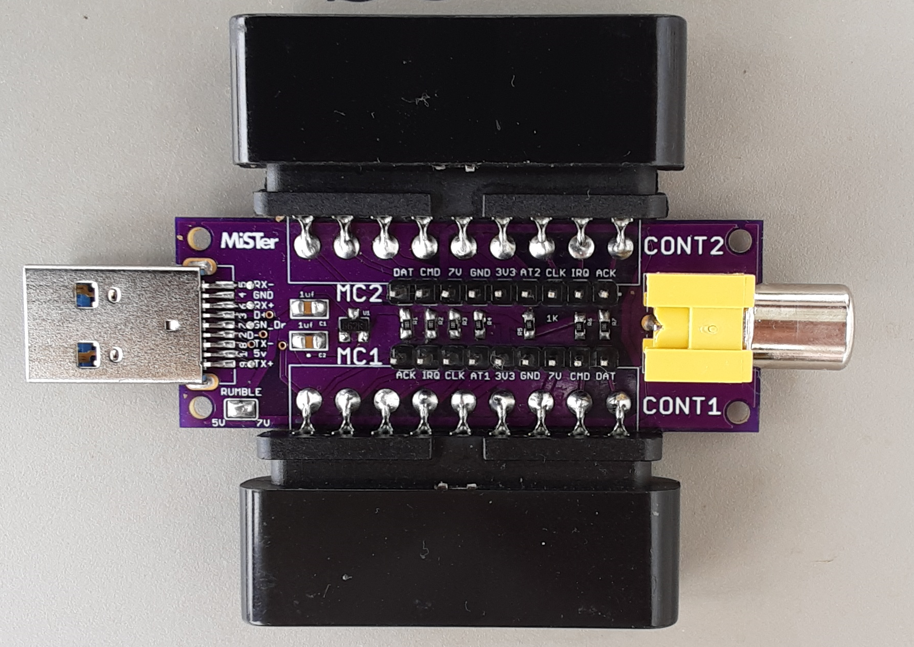

# SNAC
N64 Accessory converter for MiSTer, by blue212

Serial Native Accessory Converter

SNAC adapter for N64. This board and N64 use 3v3 logic. This is a standalone board, so it's not to used with the SNAC level shifter board. You can use a short male to female usb3.0 extension cable between it and misters USER port.

It has four ports for controllers which are independently controlled in the OSD.

Rumble, transfer, controller paks, vru and microphone all supported.

-TODO 

-Updates

Added files for 3D print cases. Designed by [DiniertoDesigns](https://www.thingiverse.com/thing:5530398)

