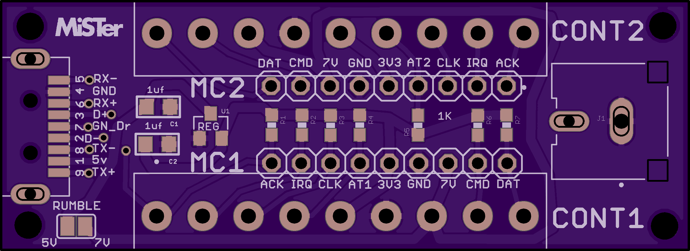
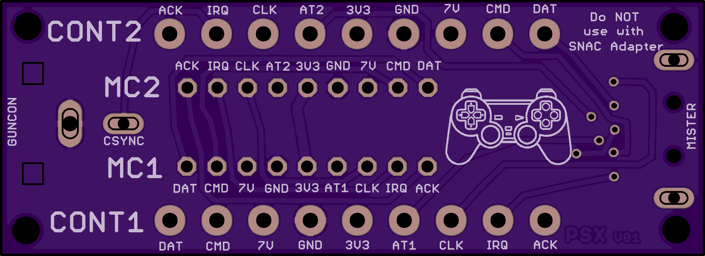

# SNAC
PSX Accessory converter for MiSTer, by blue212

Serial Native Accessory Converter

SNAC adapter for PSX. This board and psx use 3v3 logic. This is a standalone board, so it's not to used with the SNAC level shifter board. You can use a short male to female usb3.0 extension cable between it and misters USER port.

It has two ports for controllers and a composite port for guncon, also has a header for test points. If a guncon is connected and a justifier isn't the needed signal for Guncon will be output through the composite port.

This version has a solder jumper to connect 5v to the 7.6v pin for rumble. You could not solder the jumper and add external power, but be advised that bad things will happen if you mix up polarity.

-TODO 

-Updates
Added Memory Card add-on board. It uss a 0.8mm thick pcb

